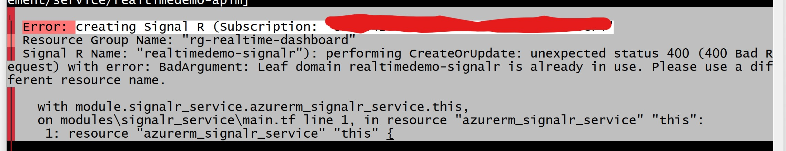

# Azure Container Sample with SignalR

- Running in `Azure App Management`
- With `Azure Container App`s
- With `Azure Log Analytics` workspace
- With `Azure SignalR Service`
- Remember to delete `Azure Container Registry` instance
- I would think I could use `Docker Hub` for this purpose, which is free

## Usage Scenarios/Best-Practices

- To do.

## Naming Conventions/Best-Practices

- To do.

## Cost Information

- `Azure API Management` won't cost anything on the `Developer Tier` (I had to update the settings in the terraform to ensure this)
- `Azure Container App` won't incur any charges if not in use (scaled to zero instances)
  - Had to double-check my config and set `min_replicas` to zero (0)
- `Azure Container App Environment` won't cause anything if on the `Consumption` plan and not being used
- `Azure Log Analytics` workspace can have costs, but I should be OK because I haven't used it yet and don't plan to keep a lot of data around
  - I am on recommended `pay-as-you-go` tier
  - I am configured for 30 days
  - Interesting setting: `PerGB2018`
- `Azure SignalR Service` will not cost me anything on the `Free` tier (`Free_F1`)
- `Azure Container Registry` instance will cost money even if not used, simply because it is provisioned
  - I will manually delete via the portal

## Working Log

### `Sunday, 5/31/2026`

- Working through [this](https://learn.microsoft.com/en-us/aspnet/core/tutorials/signalr?view=aspnetcore-10.0&tabs=visual-studio-code)

### `Saturday, 5/30/2026`

- Got this infrastructure mostly deployed
- Would like to:
  - Add set of required tags for environment, etc.
  - Add logic for naming resources that follow recommended conventions
  - For example: `APIM`
  - `{type}-{project}-{env}-{region}-{hash}`
  - Use `uniqueString(resourceGroup().id)`
  - `apim-coreapi-prod-use-a1b2c`
  - `apim-payment-dev-eus-x9y8z`
  - Limit of `50` characters, alphanumerics and hyphens only
  - Start with a letter and end with letter or number
  - [Naming Conventions](https://learn.microsoft.com/en-us/azure/azure-resource-manager/management/resource-name-rules)

- When deploying the current state of Infrastructure in terraform, I encountered:



```text
│ Error: creating Signal R (Subscription: "xxxxxxxx-yyyy-zzzz-aaaa-bbbbbbbbbbbb"
│ Resource Group Name: "rg-realtime-dashboard"
│ Signal R Name: "realtimedemo-signalr"): performing CreateOrUpdate: unexpected status 400 (400 Bad Request) with error: BadArgument: Leaf domain realtimedemo-signalr is already in use. Please use a different resource name.
│
│   with module.signalr_service.azurerm_signalr_service.this,
│   on modules\signalr_service\main.tf line 1, in resource "azurerm_signalr_service" "this":
│    1: resource "azurerm_signalr_service" "this" {

```

- This was due to non-unique resource names, added a unique/random string suffix where needed to get past this