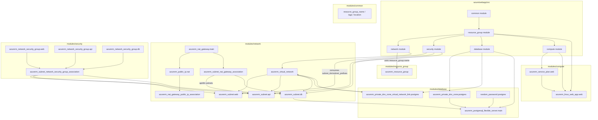

# Azure Webapp Architecture

```mermaid
flowchart TB
  subgraph root["azure/webapp/src"]
    common[common module]
    resource_group[resource_group module]
    network[network module]
    security[security module]
    database[database module]
    compute[compute module]
  end

  subgraph common_mod["modules/common"]
    RGName[resource_group_name / tags / location]
  end

  subgraph rg_mod["modules/resource_group"]
    RG[azurerm_resource_group]
  end

  subgraph net_mod["modules/network"]
    VNet[azurerm_virtual_network]
    WebSubnet[azurerm_subnet.web]
    ApiSubnet[azurerm_subnet.api]
    DbSubnet[azurerm_subnet.db]
    NATIP[azurerm_public_ip.nat]
    NATGW[azurerm_nat_gateway.main]
    NatAssoc[azurerm_nat_gateway_public_ip_association]
    SubnetNat[azurerm_subnet_nat_gateway_association]
  end

  subgraph sec_mod["modules/security"]
    WebNSG[azurerm_network_security_group.web]
    ApiNSG[azurerm_network_security_group.api]
    DbNSG[azurerm_network_security_group.db]
    NSGAssoc[azurerm_subnet_network_security_group_association]
  end

  subgraph db_mod["modules/database"]
    DNSZone[azurerm_private_dns_zone.postgres]
    DNSLink[azurerm_private_dns_zone_virtual_network_link.postgres]
    PGPassword[random_password.postgres]
    Postgres[azurerm_postgresql_flexible_server.main]
  end

  subgraph compute_mod["modules/compute"]
    ServicePlan[azurerm_service_plan.web]
    WebApp[azurerm_linux_web_app.web]
  end

  common --> resource_group
  resource_group --> network
  resource_group --> security
  resource_group --> database
  resource_group --> compute

  network -->|uses resource_group.name| RG
  network --> VNet
  VNet --> WebSubnet
  VNet --> ApiSubnet
  VNet --> DbSubnet
  VNet --> DNSLink
  NATGW --> NATIP
  NATGW --> SubnetNat
  NATIP --> NatAssoc
  SubnetNat -->|api/db subnets| ApiSubnet
  SubnetNat --> DbSubnet

  security -->|consumes subnet_ids/subnet_prefixes| WebSubnet
  security --> ApiSubnet
  security --> DbSubnet
  WebNSG --> NSGAssoc
  ApiNSG --> NSGAssoc
  DbNSG --> NSGAssoc
  NSGAssoc --> WebSubnet
  NSGAssoc --> ApiSubnet
  NSGAssoc --> DbSubnet

  database --> DNSZone
  database --> DNSLink
  DNSLink --> VNet
  database --> Postgres
  DbSubnet --> Postgres
  PGPassword --> Postgres
  DNSZone --> Postgres

  compute --> ServicePlan
  compute --> WebApp
  ServicePlan --> WebApp
  resource_group --> WebApp
```
